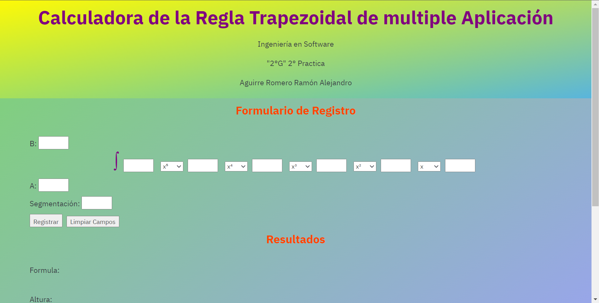
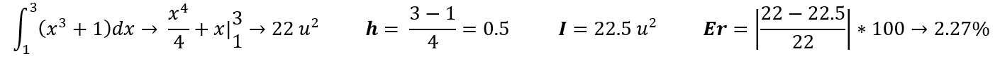
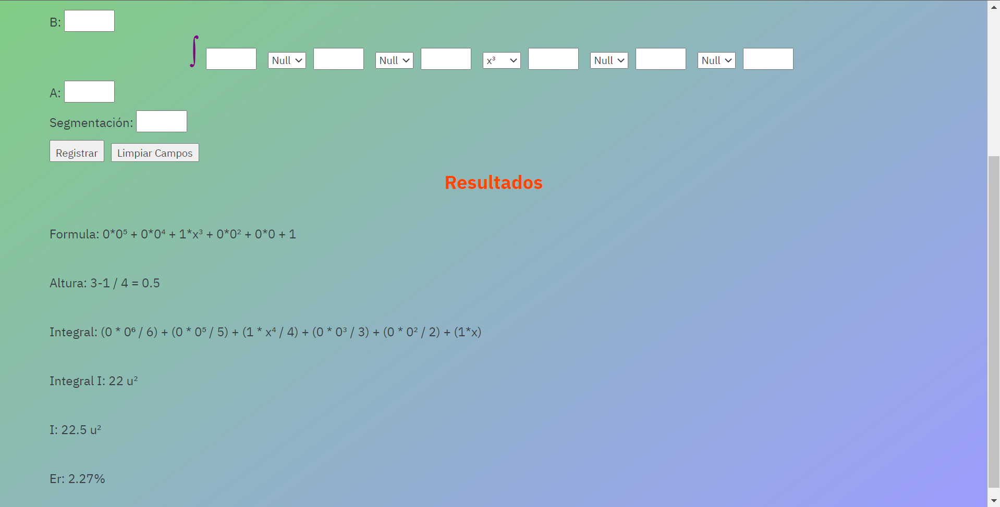
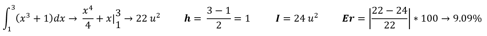
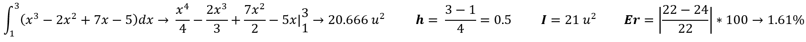
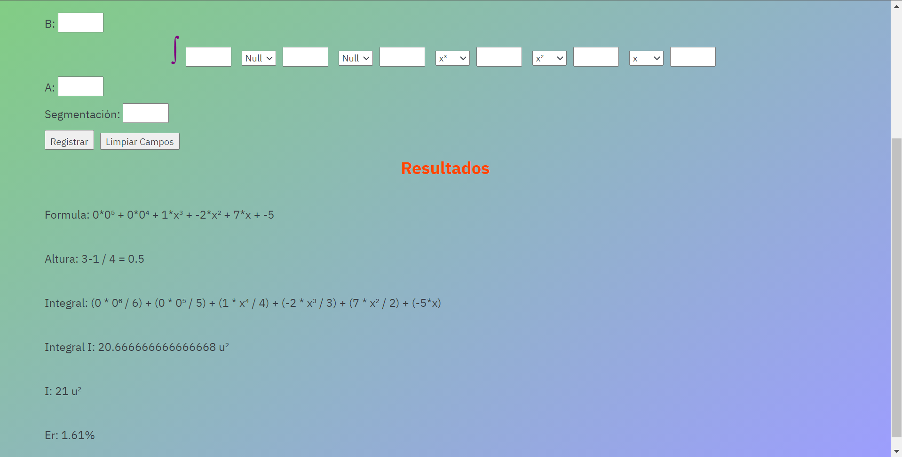

# Práctica 2: Programación de una calculadora de la Regla-Trapezoidal

- FACULTAD DE TELEMATICA
- INGENIERÍA EN SOFTWARE
- “2ºG”
- MÉTODOS NUMÉRICOS
  - CATEDRATICO: CORTÉS LUGO HUGO
  - AGUIRRE ROMERO RAMÓN ALEJANDRO

## Explicación del Programa

Como observación se tiene que en dado caso que no se vaya a llenar toda la fórmula no es necesario colocar cero ya que de manera automática si no cuenta con un número dentro entonces regresará un cero lo cual al multiplicarse por la variable inevitablemente dará cero.
además si se busca tener una mayor formalidad en la fórmula en la variable se le puede cambiar a la opción null.

> Poniendo en practica:

- Al abrir el index se podrá observar como tenemos en este caso la forma de una integral en la cual se debe ingresar los datos de A,B y N porque si no son ingresados causará que el programa te niegue proseguir con sus cálculos hasta que complete la información (Le aconsejo probar al no colocar uno de esos datos para que pueda observar el mensaje que entrega al usuario).

- Ahora después de haber ingresado los valores de A, B, y N, se tendrá la oportunidad de completar los demás recuadros y elegir si las x serán activadas o serán nulas.

- Al haber completado los datos se presiona al botón `Registrar` para que realice los cálculos o al botón `Limpear Campos` para eliminar todo lo registrado.

## Pruebas

> Ejercicio 1

- Se prueba los datos de la anterior imagen en el programa y se podra observar como es que si entrega los mismos resultados

> Ejercicio 2

- Se prueba los datos de la anterior imagen en el programa y se podra observar como es que si entrega los mismos resultados

> Ejercicio 3

- Se prueba los datos de la anterior imagen en el programa y se podra observar como es que si entrega los mismos resultados

